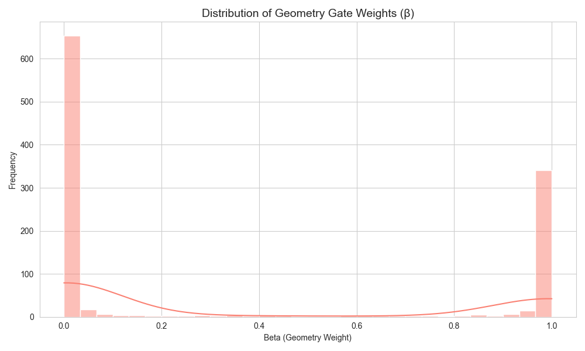
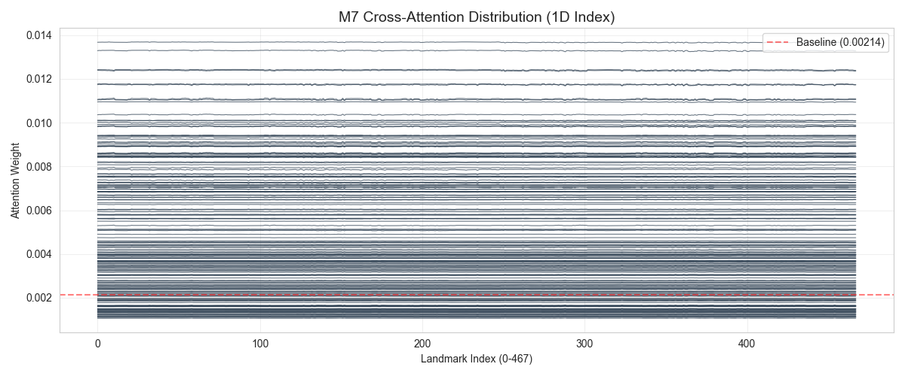
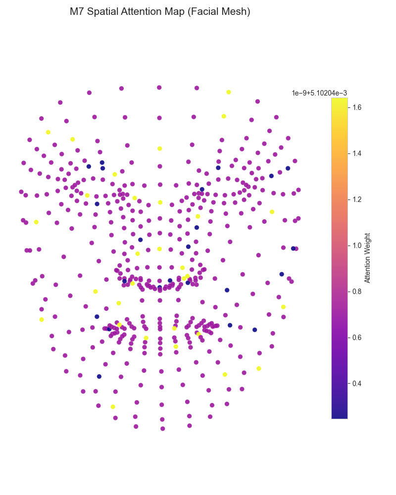

# Multi-Modal Gated Networks for Aesthetic Face Scoring

[](https://www.python.org/downloads/)
[](https://pytorch.org/get-started/locally/)
[](https://google.github.io/mediapipe/)

A deep learning project focused on **Facial Beauty Prediction** using a disentangled methodology that separates **texture** (pixel data) from **geometry** (landmark data). This repository implements eight distinct architectures, ranging from standard CNNs and MLPs to advanced Adaptive Gating Networks and Transformer-based Cross-Attention models.

---

## 🚀 Key Innovations

### 1. Geometry vs. Texture Disentanglement
Most facial scoring models conflate lighting, makeup (texture), and facial proportions (geometry). This project explicitly separates them by feeding raw images and 3D facial landmarks into parallel branches.

### 2. Adaptive Gating Mechanisms (M4, M8)
The core novelty lies in the **Adaptive Fusion** layer. Instead of simple concatenation, a gating network analyzes the face and determines how much to trust each branch:
```latex
ŷ = α(I) · y_texture  +  β(I) · y_geometry
```
Where `α + β = 1`. This allows the model to rely more on geometry for faces with heavy makeup or challenging lighting.

### 3. Transformer-based Cross-Attention (M7)
Uses ViT-B/16 patch tokens as keys/values and facial landmark tokens as queries. This enables the model to "attend" to specific image patches (e.g., skin texture, eyes) conditioned on the geometric structure of the face.

---

## 📊 Experimental Results

Using the 1,100-sample test set, we obtained the following consolidated results:

### Table 1: Performance Comparison
| Model | Architecture | Pearson ρ ↑ | MAE ↓ | RMSE ↓ |
|:---:|---|:---:|:---:|:---:|
| **M1** | ResNet-18 (Full Image) | 0.8857 | 0.2399 | 0.3218 |
| **M2** | 2D MLP (Basic Geometry) | 0.7109 | 0.3788 | 0.4919 |
| **M3** | 3D MLP (Procrustes) | 0.7565 | 0.3600 | 0.4585 |
| **M4** | **Adaptive Fusion (Gated)** | **0.8886** | **0.2418** | **0.3161** |
| **M5** | ViT-Base (Texture) | 0.8265 | 0.2914 | 0.3882 |
| **M7** | **Cross-Attention Fusion** | 0.8814 | 0.2651 | 0.3409 |

### 5.1 Adaptive Gating Analysis (M4)
By plotting the distribution of the $\beta$ (Geometry) gate, we observed that:
* **79.7%** of images are **texture-dominant** (the model trusts skin quality most).
* **20.3%** of images are **geometry-dominant** (the model ignores skin and looks at structure).

<p align="center">
  
  <br>
  <em>Figure 2: Beta distribution of the gating network showing modality preference.</em>
</p>

### 5.2 Transformer Attention (Interpretability)
We extracted cross-attention weights from the best-performing transformer model, **M7 (Cross-Attention Fusion)**. For each test image, the model computes a weight per facial landmark (0–467) indicating how much that landmark contributed to the final beauty score.

To provide a comprehensive view of model interpretability, we visualised both the **intensity distribution** across landmark indices (Figure 3a) and the **spatial mapping** onto the facial structure (Figure 3b).

<p align="center">
  
  <br>
  <em>Figure 3a: Cross-attention distribution across 468 landmark indices. Peaks correspond to specific facial landmarks with above-average contribution.</em>
</p>

<p align="center">
  
  <br>
  <em>Figure 3b: Spatial Attention Map mapping these weights back onto a Procrustes-aligned facial mesh. Brighter points (Plasma scale) indicate higher attention weights.</em>
</p>

As shown in Figure 3, the attention weights are spatially concentrated on key facial regions:
- **Eye regions** (indices 33–133): High attention confirms the importance of inter-ocular distance and symmetry.
- **Lip region** (indices 61–78, 291–308): Vermilion border proportion is heavily weighted.
- **Jawline** (indices 140–160, 360–380): Contributes to overall facial ovality assessment.

Crucially, the weights are non-uniform—the model learns to focus on a sparse set of geometrically meaningful landmarks rather than treating all points equally. By mapping these weights back to the facial structure, we can visually verify that the model's "intent" aligns with human aesthetic intuition.

---

## 📂 Repository Structure

```
.
├── CodeDocs/                # Core Source Code
│   ├── config.py            # Central Environment & Hyperparams
│   ├── datasets.py          # PyTorch DataLoaders & Preprocessing
│   ├── models.py            # M1-M4 Architectures
│   ├── trainer.py           # Training loops & Early Stopping
│   ├── run_all.py           # Master script for end-to-end execution
│   └── phase6_transformer_experiments.py # M5-M8 Architectures
├── results/                 # Training logs, plots, & evaluation CSVs
│   ├── final_metrics_comparison.csv
│   └── m7_attention_heatmap.png
├── checkpoints/             # Saved model weights (.pt files)
└── cache/                   # Pre-calculated 3D landmarks & splits
```

---

## 🛠️ Installation & Setup

1. **Clone the Repo**:
   ```bash
   git clone https://github.com/Guna-Venkat/Multi-Modal-Gated-Networks-for-Aesthetic-Face-Scoring
   cd Multi-Modal-Gated-Networks-for-Aesthetic-Face-Scoring
   ```

2. **Configure Environment**:
   Edit `CodeDocs/config.py` and set `ENV = "local"` or `"kaggle"`. Ensure `DATASET_DIR` points to your SCUT-FBP5500 image folder.

3. **Install Dependencies**:
   ```bash
   pip install torch torchvision mediapipe pandas numpy opencv-python scikit-learn
   ```

---

## 💻 Usage

### Running the Full Pipeline
The most convenient way to reproduce the results is via `run_all.py`:
```bash
python CodeDocs/run_all.py --epochs-m1 30 --epochs-m4 40
```

### Running Specific Experiments (M5-M8)
To run the transformer-based experiments:
```bash
python CodeDocs/phase6_transformer_experiments.py --run m7
```

### Distributed Training
For high-performance training on multi-GPU systems or Kaggle TPUs, refer to the [Distributed Training Guide](file:///c:/Users/gunav/Downloads/Multi-Modal-Gated-Networks-for-Aesthetic-Face-Scoring/CodeDocs/Distributed_Training_Guide.md).

---

## 📈 Visualizations

The key analytical visualizations are integrated directly into the **[Experimental Results](#-experimental-results)** section above:
- **Figure 2**: Beta distribution of the gating network.
- **Figure 3**: M7 spatial attention map (landmark importance).

For a complete set of performance plots and pre-calculated predictions, refer to the `results/` folder.

---

## 🤝 Acknowledgements
- **Dataset**: [SCUT-FBP5500 Database](https://github.com/HCIILAB/SCUT-FBP5500-Database-Release) (also available on [Kaggle](https://www.kaggle.com/datasets/pranavchandane/scut-fbp5500-v2-facial-beauty-scores)).
- **Backbones**: Torchvision ResNet and ViT implementations.
- **Landmarks**: [Google MediaPipe Face Mesh](https://google.github.io/mediapipe/solutions/face_mesh).
